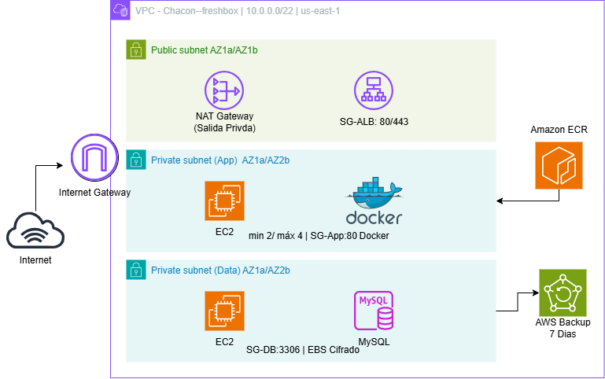

# ARY1102-EP1-Cloud — Chacón

Infraestructura como código (Terraform) para la Evaluación Parcial n°1 de
Arquitectura Cloud (DuocUC). Diseña e implementa en AWS la arquitectura base
de **FreshBox SpA** (catálogo online de productos orgánicos): frontend Nginx +
4 microservicios Node/Express + MySQL en EC2 dedicado, con alta disponibilidad
Multi-AZ y despliegue en contenedores Docker.

Este repositorio parte de una base propia previa:
[Examen Final de Cloud](https://github.com/Nico-Chacon/ARY1101-EXAMEN-Cloud)

Este adapta por completo para el caso FreshBox: se
reemplaza la app, se reemplaza RDS por una EC2 dedicada con MySQL (según lo
exige el enunciado EP1), se generaliza ECR a 5 repositorios y se corrige el
despliegue de las EC2 App a subredes realmente privadas.

## Diagrama de la infraestructura

## Módulos incluidos

| Módulo       | Descripción                                                          |
|--------------|-----------------------------------------------------------------------|
| networking   | VPC /22 de 3 capas: 2 subredes públicas (Web), 2 privadas (App), 2 privadas (Data), IGW, 2 NAT GW |
| security     | Security Groups segmentados por capa: ALB → App → Data (mínimo privilegio) |
| ecr          | 5 repositorios ECR (frontend, get-products, create-product, update-product, delete-product) |
| database     | EC2 (t4g.small) + MySQL dedicado en la capa Data, EBS cifrado          |
| loadbalancer | Application Load Balancer + Target Group (puerto 80)                  |
| compute      | EC2 Auto Scaling Group (min 2 / máx 4) en subredes privadas App, despliega los 5 contenedores vía Docker Compose desde ECR |
| backup       | AWS Backup diario (7 días de retención) para la EC2 MySQL, usando el `LabRole` de AWS Academy |
| monitoring   | CloudWatch Alarms (ASG, ALB, EC2 MySQL) + SNS + Dashboard              |
| budgets      | AWS Budgets con alertas 60/80/100% vía SNS                             |
| cloudtrail   | Auditoría de eventos + bucket S3 para logs                            |

## Estructura del repositorio

```
.
├── app/                        # Código fuente FreshBox
│   ├── frontend/                # Nginx + HTML/CSS/JS (rutas relativas /api/products)
│   ├── backend/get-products/    # Microservicio GET  (puerto 3001)
│   ├── backend/create-product/  # Microservicio POST (puerto 3002)
│   ├── backend/update-product/  # Microservicio PUT  (puerto 3003)
│   ├── backend/delete-product/  # Microservicio DELETE (puerto 3004)
│   ├── db/init.sql              # BD freshbox + 5 productos orgánicos
│   └── build-and-push.sh        # Build + push de las 5 imágenes a ECR
├── environments/dev/           # Orquestación (main.tf, variables, outputs, backend)
├── modules/                    # Módulos Terraform reutilizables
├── scripts/
│   ├── user-data-app.sh.tpl     # Bootstrap EC2 App (Docker + 5 contenedores)
│   └── user-data-db.sh.tpl      # Bootstrap EC2 Data (MySQL + init.sql)
└── .github/workflows/          # CI/CD: plan, apply, destroy
```

## Cómo enruta el tráfico (clave de la arquitectura)

El **ALB solo expone el puerto 80**. El contenedor `frontend` (Nginx) recibe
todo el tráfico en ese puerto y, según el método HTTP, hace `proxy_pass`
internamente (por la red de docker-compose) hacia el microservicio correcto:

```
Internet → ALB (:80) → EC2 App (:80 Nginx)
                          ├── GET    → get-products:3001
                          ├── POST   → create-product:3002
                          ├── PUT    → update-product:3003
                          └── DELETE → delete-product:3004
                                          ↓
                                EC2 MySQL (:3306, capa Data)
```

Por eso el frontend (`js/app.js`) llama siempre a rutas **relativas**
(`/api/products`) y nunca a puertos 3001-3004 directamente: así solo hace
falta un Target Group en el puerto 80 en el ALB.

## Tagging obligatorio

| Tag         | Valor                |
|-------------|-----------------------|
| Project     | chacon-freshbox        |
| Environment | dev                    |
| Owner       | Chacon                 |
| CostCenter  | freshbox-organicos     |
| ManagedBy   | terraform              |


